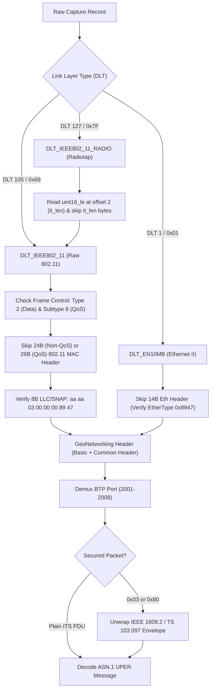

# Packet Dissection & Wire-Framing Reference

## 1. PCAP Header & Timestamp Scales

C-ITS packet captures are stored in classic PCAP or PCAPNG formats. The file magic number defines byte-order and timestamp resolution:

| Magic Number (Hex) | Link-Format | Timestamp Unit | Timestamp Scale Multiplier |
| :--- | :--- | :--- | :--- |
| `0xa1b2c3d4` | PCAP Big-Endian | Microseconds ($\mu s$) | $1\,000\,000$ ($10^6$) |
| `0xd4c3b2a1` | PCAP Little-Endian | Microseconds ($\mu s$) | $1\,000\,000$ ($10^6$) |
| `0xa1b23c4d` | PCAP Big-Endian | Nanoseconds ($ns$) | $1\,000\,000\,000$ ($10^9$) |
| `0x4d3cb2a1` | PCAP Little-Endian | Nanoseconds ($ns$) | $1\,000\,000\,000$ ($10^9$) |
| `0x0a0d0d0a` | PCAPNG Section Header | Defined by `if_tsresol` | Usually $10^6$ or $10^9$ |

> [!CAUTION]
> **Nanosecond Magic Trap**: When reading nanosecond PCAPs (`0xa1b23c4d`), treating `ts_usec` as microseconds will cause all relative time calculations to be distorted by a factor of 1,000. Always check the magic bytes before scaling timestamps.

---

## 2. Link-Layer Types (DLT) & Unwrapping Pipeline

Real-world test captures (such as Linux-based RSU sniffs or 802.11p mobile drives) contain diverse link-layer encapsulations:

### 2.1 DLT 127 (Radiotap + 802.11 + LLC/SNAP) — 98% of Field Captures
1. **Radiotap Header**:
   - Offset `0x00`: Header Revision (`0x00`)
   - Offset `0x01`: Header Pad (`0x00`)
   - Offset `0x02..0x04`: 16-Bit Little-Endian Header Length (`it_len`). Skip exactly `it_len` bytes.
2. **802.11 MAC Header**:
   - First 2 bytes = Frame Control Word (Little-Endian `uint16`).
   - `Type = (fc >> 2) & 0x03` $\to$ Must be `2` (Data).
   - `Subtype = (fc >> 4) & 0x0F` $\to$ If `8`, Frame is **QoS Data**.
   - Length: Standard MAC is **24 Bytes**; QoS Data is **26 Bytes** (includes 2 Bytes QoS Control).
3. **LLC / SNAP Header**:
   - Must match exactly: `aa aa 03 00 00 00 89 47` (DSAP `0xaa`, SSAP `0xaa`, Control `0x03`, OUI `0x000000`, EtherType `0x8947` GeoNetworking).

---

## 3. Basic Transport Protocol (BTP) Destination Ports

GeoNetworking delegates transport delivery to BTP (ETSI EN 302 636-5-1):
- **BTP-A** (Interactive): 2 Bytes Source Port + 2 Bytes Destination Port.
- **BTP-B** (Non-interactive): 2 Bytes Destination Port + 2 Bytes Destination Port Info.

Standard European C-ITS BTP Destination Ports:

| BTP Port | Protocol | Full Name | Standard |
| :--- | :--- | :--- | :--- |
| **2001** | **CAM** | Cooperative Awareness Message | ETSI EN 302 637-2 / TS 103 900 |
| **2002** | **DENM** | Decentralized Environmental Notification | ETSI EN 302 637-3 / TS 103 831 |
| **2003** | **MAPEM** | Map Extended (Topology) | ISO TS 19091 / ETSI TS 103 301 |
| **2004** | **SPATEM** | Signal Phase and Timing Extended | ISO TS 19091 / ETSI TS 103 301 |
| **2006** | **IVIM** | Infrastructure to Vehicle Information | ISO TS 19321 / ETSI TS 103 301 |
| **2007** | **SREM** | Signal Request Extended (Priority) | ISO TS 19091 / ETSI TS 103 301 |
| **2008** | **SSEM** | Signal Status Extended (Priority Status) | ISO TS 19091 / ETSI TS 103 301 |

---

## 4. Security Envelope Stripping (IEEE 1609.2 / ETSI TS 103 097)

If the payload following BTP begins with byte `0x03` or `0x80`, it contains an IEEE 1609.2 security wrapper:
- `0x03`: Secured Data format version.
- Outer payload contains Content Type (`signedData`, `encryptedData`, or `unsecuredData`), Signer Info (digest or certificate), and Signature.
- Extract the inner `to-be-signed` payload to access the plain ASN.1 UPER-encoded ITS message.
