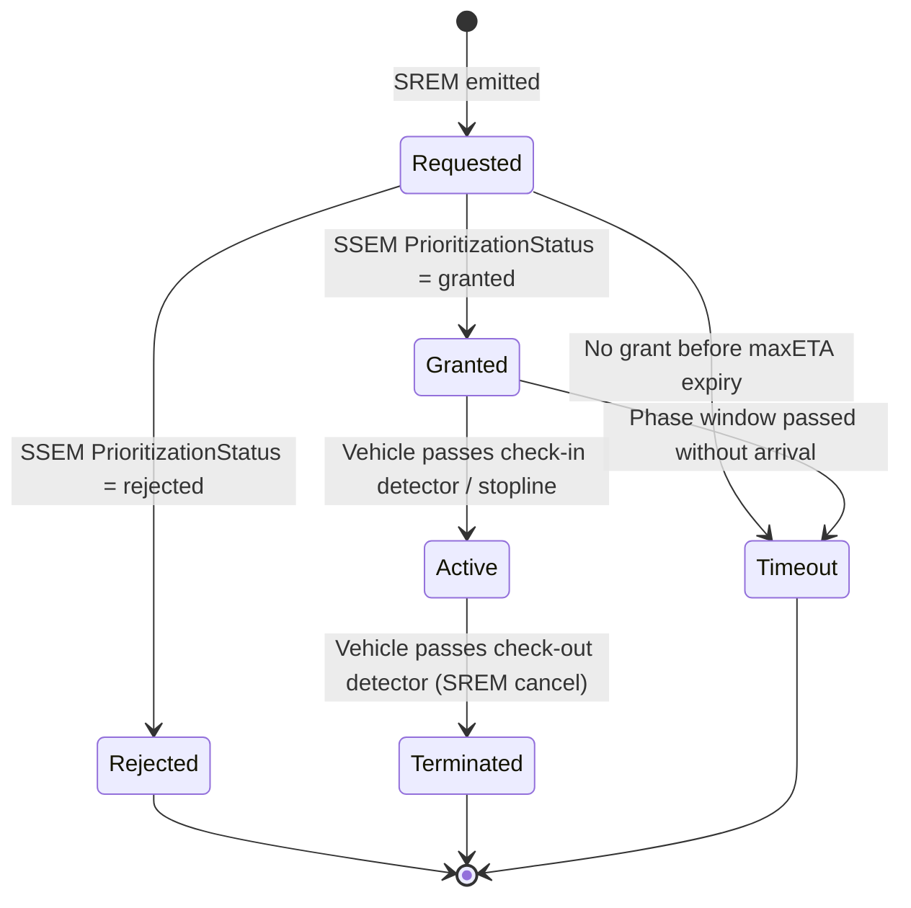

# Signal Prioritization (SREM / SSEM) & GLOSA Reference

## 1. Request-Prioritization via SREM & SSEM

Signal Request Extended Messages (SREM) allow emergency vehicles (police, fire, ambulance) and public transit (buses, trams) to request green priority at traffic intersections. The infrastructure answers with Signal Status Extended Messages (SSEM).

### 1.1 The 4-Tuple Correlation Invariant
To correlate an inbound SREM request with its corresponding SSEM status responses across network capture jitter, match against the canonical **4-Tuple**:

$$\text{Correlation Key} = (\text{intersectionId},\ \text{requestId},\ \text{sequenceNumber},\ \text{requestorStationId})$$

- `intersectionId`: Numeric identifier of the target intersection.
- `requestId`: 8-bit integer assigned by the requesting vehicle.
- `sequenceNumber`: Rolling sequence counter incremented on renewals.
- `requestorStationId`: 32-bit station identifier of the requesting vehicle (e.g. emergency vehicle OBU).

### 1.2 Prioritization State Machine

---

## 2. GLOSA (Green Light Optimal Speed Advisory)

GLOSA guides vehicles to approach intersections at speeds that permit passing the stopline during an active green phase without stopping:

### 2.1 Advisory Calculation
Given:
- $d$: Distance to stopline along lane centerline (meters).
- $t_{green\_start}$: Seconds until start of green phase (from SPATEM `minEndTime` of red phase).
- $t_{green\_end}$: Seconds until end of green phase (from SPATEM `minEndTime` of green phase).
- $v_{road\_max}$: Maximum legal road speed (e.g. $50$ km/h $= 13.89$ m/s).
- $v_{road\_min}$: Minimum practical cruising speed (e.g. $20$ km/h $= 5.56$ m/s).

The recommended speed window $[v_{min}, v_{max}]$ satisfies:

$$v_{max} = \min\left(v_{road\_max},\ \frac{d}{t_{green\_start}}\right)$$
$$v_{min} = \max\left(v_{road\_min},\ \frac{d}{t_{green\_end}}\right)$$

If $\frac{d}{v_{road\_max}} > t_{green\_end}$, the vehicle cannot make the current green phase safely and must decelerate smoothly for the following cycle.
